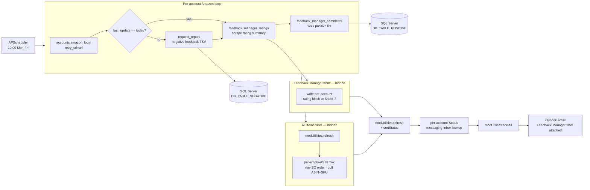

# amzn-feedback-manager

> **Status: retired** — the workbook (`Feedback-Manager.xlsm`) has been moved out of the active reports folder and the script is no longer running on the daily schedule. The repo is kept in the portfolio because the **Python ↔ VBA ↔ SQL ↔ Excel-driven order lookup** loop is a representative end-to-end automation pattern.

Weekday automation that ingests each Amazon Seller Central storefront's **negative + positive feedback** into SQL Server, scrapes the feedback ratings summary into a per-account block of `Feedback-Manager.xlsm`, and uses a sibling workbook (`All Items.xlsm`) to drive a follow-up Seller Central order-detail lookup for every newly-flagged feedback.

The script is **one Python file** orchestrating five external surfaces: SeleniumBase (Amazon login + report download + ratings/comments scrape + per-order detail nav), SQL Server via `database_utils.insert_dataframe` (two tables — `DB_TABLE_NEGATIVE` and `DB_TABLE_POSITIVE` — with `last_update`/`find_order` idempotency checks), xlwings + 3 VBA macros on `Feedback-Manager.xlsm` and 1 macro on `All Items.xlsm` (synchronous `modUtilities.refresh` + `sortAll` + `sortStatus`), Outlook (weekday email), and APScheduler (`Mon-Fri 10:00`).

## Daily flow

1. **Per-account negative feedback** — for each account in `AMAZON_URLS`, log into Seller Central (OTP retry via `retry_url=url`), check `last_update` against today's date — if not loaded, call `request_report` (7-day on Mondays, 1-day otherwise), download the negative-feedback report, insert new rows into `DB_TABLE_NEGATIVE`.
2. **Ratings scrape** — read the feedback summary table on the account's Seller Central page, write the 7×4 metrics block (Positive/Neutral/Negative %/Count + Totals × 30d/90d/365d/Lifetime) into the per-account cell anchor on Sheet 7 (`Feedback Rating`) of `Feedback-Manager.xlsm`.
3. **Positive feedback scrape** — walk the Positive Feedback list, skip orders already in `DB_TABLE_POSITIVE` (`find_order` check), insert new ones row-by-row.
4. **All-Items order-detail lookup** — refresh `All Items.xlsm` (synchronous `modUtilities.refresh`), find empty ASIN+SKU rows on the Feedback-Manager sheet, navigate Seller Central per order to extract ASIN+SKU, write back to the workbook, refresh again.
5. **Status pass + sort + email** — refresh `Feedback-Manager.xlsm`, call `sortStatus` to surface open items, walk each per-account sheet to fill in messaging-inbox status per order, then `sortAll` (Date desc, Order ID asc), save, email via Outlook.

## Architecture



## Performance notes

The script's slowest legs are the per-account Seller Central scrapes
and the per-order messaging-inbox lookup; here's what was tuned during
the Phase 4 polish (before retirement) to avoid making them worse:

- **Synchronous Power Query refresh.** Both `Feedback-Manager.xlsm` and
  `All Items.xlsm` use `modUtilities.refresh` which iterates each
  connection, forces `BackgroundQuery = False`, and refreshes them in
  order. The Python side no longer needs a `time.sleep()` to wait.
- **Idempotency checks** — `last_update` short-circuits the negative
  feedback download if today's already loaded; `find_order` short-
  circuits the positive feedback insert per Order ID.
- **Excel runs hidden.** Both workbooks open via `xw.App(visible=False,
  add_book=False)` with `display_alerts = False`.
- **Macros called inline** — `wb.macro("modUtilities.X")()` directly,
  no intermediate proxy vars.
- **VBA hardening.** All 5 subs (3 in `Feedback-Manager`, 2 in
  `All Items`) run inside `ScreenUpdating=False`,
  `Calculation=xlCalculationManual`, `EnableEvents=False`, with
  `On Error GoTo Cleanup` blocks that restore Application state.

## Logging

```text
10:00:02 INFO     Navigating to AccountKeyA account.
10:00:11 INFO     Checking if Feedback Manager's files have been downloaded.
10:00:12 INFO     Getting AccountKeyA 1-day Feedback Manager Report.
10:00:31 INFO     File downloaded successfully. Loading to database.
10:00:34 INFO     Data inserted successfully in table FedManNegative.
10:00:39 INFO     Getting AccountKeyA feedback ratings.
10:01:08 INFO     Getting Positive Feedback comments for AccountKeyA.
10:01:42 INFO     Order 123-4567890-1234567 data inserted successfully in table FedManPositive.
10:08:24 INFO     Opening All Items and refreshing queries.
10:09:12 INFO     Refreshing all queries on Feedback Manager workbook.
10:09:28 INFO     Sorting all tables, saving and closing workbook.
10:10:31 INFO     Email has been sent.
```

Configured once via the shared helper:

```python
from fc_utils.logging_utils import setup_logging
log = setup_logging("amzn_feedback_manager")
```

`setup_logging` wires a Rich console handler (colorized output, markup
rendering, rich tracebacks) and a 1 MB rotating file handler writing to
`logs/<name>.log`. Available to every automation that imports `fc_utils`.

## Project layout

```
amzn-feedback-manager/
├── run_amzn_feedback_manager.py    # entry point (single script)
├── config/
│   ├── accounts.json.example       # Amazon names+URLs + per-account sheet index + per-account rating-cell anchor
│   └── paths.json.example          # workbook + sibling-workbook paths
├── vba/
│   ├── modUtilities.bas            # Feedback-Manager.xlsm — refresh + sortAll + sortStatus
│   └── all_items_modUtilities.bas  # All Items.xlsm — refresh + sortAll (shared with amzn-catalog-health)
├── screenshots/                    # crash screenshots (gitignored)
├── logs/                           # rotating run logs (gitignored)
├── downloaded_files/               # Chrome download landing zone (gitignored)
├── output/                         # reserved for future use (gitignored)
├── .env.example
├── requirements.txt
└── README.md
```

## Setup

### 1. Clone and create the venv

```powershell
git clone https://github.com/dominicci13/amzn-feedback-manager.git
cd amzn-feedback-manager
py -3.12 -m venv .venv
.venv\Scripts\pip install -r requirements.txt
.venv\Scripts\pip install git+https://github.com/dominicci13/shared-python-utils.git
```

### 2. Configure

```powershell
copy .env.example .env
copy config\accounts.json.example config\accounts.json
copy config\paths.json.example config\paths.json
```

Edit each file with real values. All three are gitignored.

`config/accounts.json` has four top-level keys:

- `amazon_account_names` / `amazon_urls` — consumed by `fc_utils.accounts.iter_amazon_accounts()`.
- `feedback_manager_sheets` — maps each account key to its 1-indexed sheet number in `Feedback-Manager.xlsm` (sheets 1-6 are the per-account tables; sheet 7 is "Feedback Rating"; sheets 8-9 are positive/negative DB readouts).
- `feedback_manager_rating_cells` — maps each account key to the top-left cell of its 7×4 ratings block on Sheet 7. The Feedback Rating layout puts 2 accounts per row-block: B/C-F (cols) + H/I-L for accounts 1+2 (rows 5-12), 3+4 (rows 16-23), 5+6 (rows 27-34).

### 3. SQL Server tables

Two tables, named by `DB_TABLE_NEGATIVE` (default `FedManNegative`) and `DB_TABLE_POSITIVE` (default `FedManPositive`). Required columns:

- **Negative:** `Account`, `Date`, `Rating`, `Comments`, `Response`, `OrderID`, `RaterEmail`, `UpdatedAt`
- **Positive:** `Account`, `Date`, `Rating`, `OrderID`, `Comments`

### 4. VBA modules (one-time per workbook)

- `Feedback-Manager.xlsm` must contain `modUtilities` from `vba/modUtilities.bas` (3 subs: refresh + sortAll + sortStatus).
- `All Items.xlsm` must contain `modUtilities` from `vba/all_items_modUtilities.bas` (2 subs: refresh + sortAll). This workbook is shared with `amzn-catalog-health` — keep the contents in sync between the two repo copies.

### 5. Run

```powershell
.venv\Scripts\python run_amzn_feedback_manager.py
```

The script prompts "Run now?" — answer **Y** to execute immediately, or **N** to register the APScheduler job and idle until the next **Mon-Fri 10:00** trigger.

## Environment variables

| Variable | Description |
|---|---|
| `AMZN_email` | Amazon Seller Central login email |
| `AMZN_pass` | Amazon Seller Central password |
| `CHROME_USER_DATA_DIR` | Path to the persistent Chrome profile directory used by the bot |
| `ALERT_EMAIL` | Outlook recipient for unhandled-exception crash reports |
| `SENDER_EMAIL` | Outlook account used to send the report email |
| `TO_EMAIL` | Comma-separated recipients |
| `CC_EMAIL` | Comma-separated CC list (optional) |
| `DB_TABLE_NEGATIVE` | SQL Server table for negative feedback (default: `FedManNegative`) |
| `DB_TABLE_POSITIVE` | SQL Server table for positive feedback (default: `FedManPositive`) |

## License

[MIT](LICENSE)
